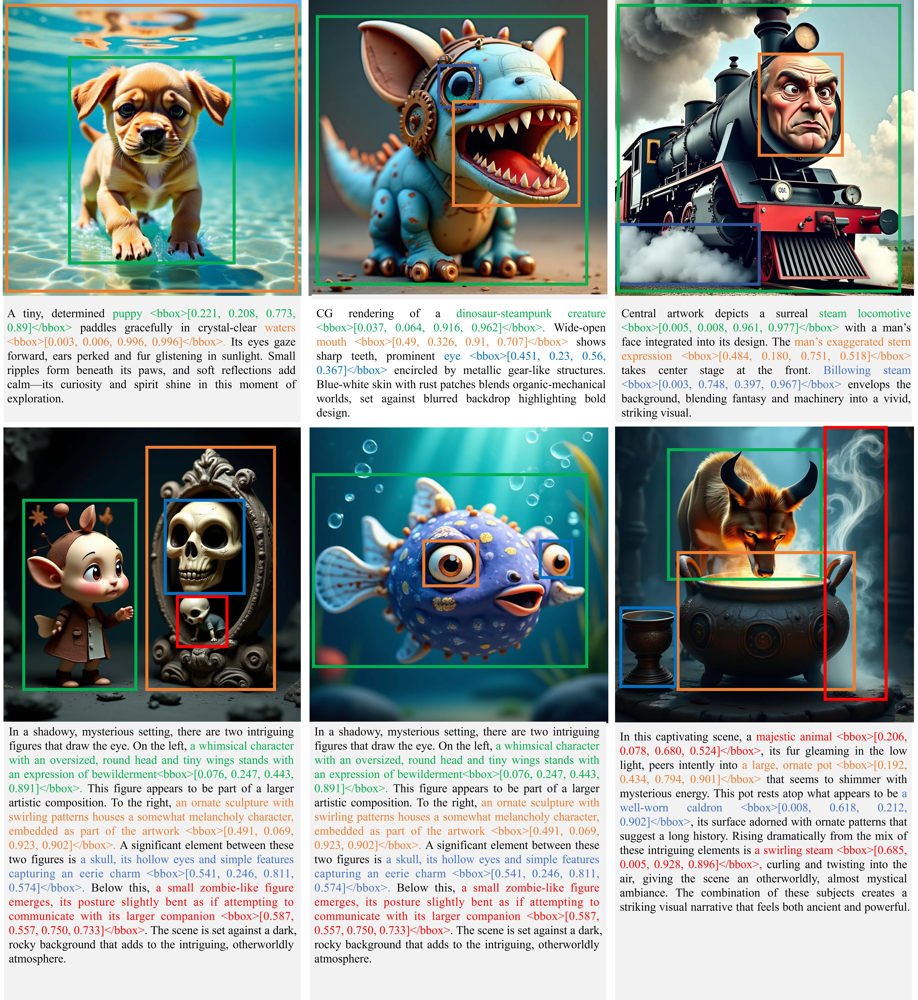

# ConsistCompose: 面向图像合成的统一多模态布局控制

<div align="center">
  <a href="README_zh.md">简体中文</a> | <a href="README.md">English</a>
<div>

<p align="center">
    <a href="https://arxiv.org/abs/2511.18333" target="_blank">
        
    </a>
    <a href="https://sensenova.github.io/ConsistCompose/" target="_blank">
        
    </a>
    <a href="https://huggingface.co/sensenova/ConsistCompose-BAGEL-7B-MoT" target="_blank">
        
    </a>
    <a href="https://huggingface.co/datasets/sensenova/ConsistCompose3M" target="_blank">
        
    </a>
    <a href="https://github.com/OpenSenseNova/ConsistCompose" target="_blank">
        
    </a>
</p>
</div>

## 概述
ConsistCompose 是一款面向**布局可控多实例图像合成**的新型统一多模态框架。该框架解决了现有多模态模型的核心痛点——多数模型虽擅长视觉定位（将语言与图像区域对齐），但在生成任务中缺乏对空间布局的精准控制能力。

ConsistCompose 基于 BAGEL 的统一理解与生成架构构建，并结合 SenseNova-SI 空间智能能力进行增强，创新性提出**语言嵌入型布局锚定生成（LELG）** 范式：将布局坐标直接以文本令牌形式嵌入语言提示词中，无需专用空间编码器或任务专属分支。为支撑大规模训练，我们构建了 **ConsistCompose3M**（340 万样本）高质量数据集，该数据集包含布局和身份标注，可为统一多模态学习提供结构化的空间语义监督。

ConsistCompose 在布局控制基准测试中达到业界领先性能，同时保持强大的通用多模态能力，为精准、灵活的图像合成提供了一套规范的解决方案。

<p align="center"></p>

## 最新动态
- [2026-02-27] 正式发布 ConsistCompose 代码仓库、**ConsistCompose-BAGEL-7B-MoT** 模型及 **ConsistCompose3M** 数据集（Hugging Face）
- [2026-02-22] 相关研究成果被 **CVPR2026** 接收
- [2025-11-23] 论文首次提交至 arXiv ([2511.18333](https://arxiv.org/abs/2511.18333))

## 📊 基准测试结果

### 1. COCO-Position（布局控制）
| 方法 | 实例成功率（平均） | 图像成功率（平均） | mIoU | AP | AP50 | AP75 |
|------|--------------------|--------------------|------|----|------|------|
| GLIGEN | 82.6% | 52.1% | 69.0 | 40.5 | 75.9 | 39.1 |
| InstanceDiffusion | 87.8% | 65.5% | 78.1 | 57.2 | 83.6 | 65.5 |
| MIGC++ | 86.8% | 63.4% | 74.9 | 48.3 | 79.2 | 52.6 |
| CreatiLayout | 74.0% | 42.5% | 64.9 | 32.4 | 61.1 | 31.6 |
| PlanGen | 82.5% | 50.3% | 66.2 | 31.9 | 74.0 | 21.5 |
| **Ours (ConsistCompose)** | **92.6%** | **76.1%** | **85.3** | **70.9** | **89.1** | **76.9** |

> 相较于当前最优基线方法，mIoU 提升 7.2%，AP 提升 13.7%

### 2. MS-Bench & MS-Bench-Random
| 方法 | MS-Bench | | | | MS-Bench-Random | | | |
|------|----------|------|------|----|----------------|------|------|----|
|      | CLIP-T | DINO | mIoU | AP | CLIP-T | DINO | mIoU | AP |
| GLIGEN | 0.309 | 0.454 | 0.868 | 0.751 | 0.312 | 0.431 | 0.858 | 0.722 |
| MS-Diffusion | 0.336 | 0.555 | 0.466 | 0.108 | 0.334 | 0.544 | 0.464 | 0.105 |
| MUSE | 0.320 | 0.619 | 0.698 | 0.352 | 0.321 | 0.607 | 0.673 | 0.303 |
| **Ours (ConsistCompose)** | **0.333** | **0.660** | **0.889** | **0.789** | **0.334** | **0.630** | **0.878** | **0.756** |

### 3. 通用多模态能力
| 模型 | MMBench | MMMU | GenEval | GEdit |
|------|---------|------|---------|-------|
| Bagel Base | 81.4 | 46.4 | 0.86 | 6.68 |
| Ours (无坐标) | 81.5 | 39.4 | 0.88 | 6.23 |
| Ours (有坐标) | 81.4 | 42.3 | 0.88 | 6.31 |

### 4. DreamBench（身份保留）
| 方法 | Single | | | Multi | | |
|------|--------|--------|--------|-------|-------|-------|
|      | DINO | CLIP-I | CLIP-T | DINO | CLIP-I | CLIP-T |
| UNO | 0.661 | 0.796 | 0.304 | 0.491 | 0.715 | 0.323 |
| OmniGen | 0.554 | 0.746 | 0.322 | 0.441 | 0.692 | 0.341 |
| OmniGen2 | 0.671 | 0.791 | 0.312 | 0.459 | 0.698 | 0.333 |
| **Ours (ConsistCompose)** | **0.677** | **0.792** | **0.314** | **0.506** | **0.703** | **0.335** |

## 🛠️ 快速开始

### 环境安装
推荐使用 [uv](https://docs.astral.sh/uv/) 进行快速环境管理（支持 macOS/Linux/Windows），也可使用 pip 安装：
```bash
# 克隆代码仓库
git clone git@github.com:OpenSenseNova/ConsistCompose.git
cd ConsistCompose/

# 创建并激活 conda 环境
conda create -n cc python=3.10 -y
conda activate cc

# 安装基础依赖
pip install -r requirements.txt

# 安装 flash_attn（关键依赖）
pip install flash_attn==2.5.8 --no-build-isolation
```

### 核心示例

#### 1. 文本到图像的布局控制合成
该示例实现**基于布局锚定的文本到图像生成**，通过在提示词中嵌入归一化边界框坐标，可对输出图像中每个物体的位置和尺寸实现精准的空间控制。

```bash
python example_text2image.py  \
 --prompt "In a dimly lit cavern, a powerful dragon <bbox>[0.380, 0.086, 0.768, 0.673]</bbox> stands majestically, its textured scales glistening in the flickering firelight. Beside it, a brave man <bbox>[0.155, 0.231, 0.439, 0.717]</bbox> clad in armor, stands poised with determination, his hand gripping the hilt of a gleaming sword <bbox>[0.166, 0.401, 0.577, 0.663]</bbox> that reflects the dancing flames. The air is tense with anticipation as sparks rise from the crackling fire, illuminating the rocky surroundings and casting intricate shadows on the cavern walls. This scene paints a vivid picture of medieval fantasy, capturing a moment that is both dramatic and full of potential action." \
 --mode layout_t2i \
 --model_path sensenova/ConsistCompose-BAGEL-7B-MoT
```

#### 2. 多参考图像的布局控制合成
该示例支持**保留身份的多参考图像合成**，模型会保留参考图像中主体的视觉特征，同时按照给定的布局约束排列这些主体。

```bash
python example_subject_driven.py \
  --model_path sensenova/ConsistCompose-BAGEL-7B-MoT \
  --jsonl_path examples/layout_subject_driven.jsonl \
  --mode layout_subject_driven
```

### 数据集下载
通过 Hugging Face Datasets 加载 ConsistCompose3M 数据集：
```python
from datasets import load_dataset

dataset = load_dataset("sensenova/ConsistCompose3M", split="train")

t2i_dataset = load_dataset("sensenova/ConsistCompose3M", data_files="jsonl_extended/layout_t2i/*.jsonl")
```


## 🖊️ 引用
如果你的研究中使用了 ConsistCompose、ConsistCompose3M 或相关资源，请引用以下论文：
```bib
@article{shi2025consistcompose,
  title={ConsistCompose: Unified Multimodal Layout Control for Image Composition},
  author={Shi, Xuanke and Li, Boxuan and Han, Xiaoyang and Cai, Zhongang and Yang, Lei and Lin, Dahua and Wang, Quan},
  journal={arXiv preprint arXiv:2511.18333},
  year={2025}
}
```

## 许可证
- ConsistCompose 框架及模型基于 [Apache-2.0 许可证](LICENSE) 开源。
- ConsistCompose3M 数据集同样采用 Apache-2.0 许可证，衍生数据需遵循额外条款（详见数据集 [README](https://huggingface.co/datasets/sensenova/ConsistCompose3M/blob/main/README.md)）。
